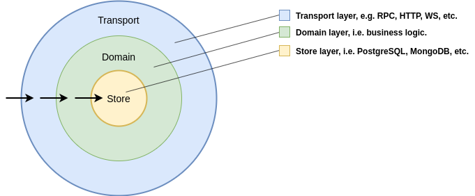

[gomicro]: https://github.com/micro/go-micro
[nats]: https://nats.io/
[docker]: https://www.docker.com/
[dockercompose]: https://docs.docker.com/compose/
[gomodules]: https://blog.golang.org/using-go-modules

# Go Micro Boilerplate

This is the example with clear architecture/structure of the project based on 
GoLang programming language and micro-services.

[Go Micro][gomicro] framework provides the core requirements for distributed systems development 
including RPC and Event driven communication.
Read more about this framework on their official [GitHub page][gomicro].


We use [NATS][nats] as a discovery service, message broker service, and transport channel.

All services are [dockerized][docker] and can be adjusted by [docker-compose][dockercompose] configuration.
Check Dockerfiles and docker-compose.yaml file in the root of the project.

Use [Go modules][gomodules] to manage dependencies of the project. 

### Structure of the project:

This section describes and explains the files and directories structure of the project. 

#### `./proto` directory

Contains protocol buffers models of each service where it exists.
Your services use protocol buffer messages as the main communication objects.

#### `./scripts` directory

Contains bash scripts. You may see `generate.sh` scripts there. 
It's needed to generate GoLang models of proto messages.
To generate proto files, execute the following command from the root of the project 
```bash
$ ./scripts/generate.sh .
```
Also, to build the base image for services, you may use `build-base-image.sh` script:
```bash
$ ./scripts/build-base-image.sh
```

#### `./services` directory
 
Contains the logic of all of the services.
Once you wand to create a new service, you may create a new directory with `<service-name>-svc` format.
Inside of the created directory you can put the logic of your service like it's done with `account-svc`.
 
#### `./utils` directory
 
Contains common packages used across the services.

#### `./vendor` directory (git ignored)

Contains dependencies. Execute the following from the root of the project to setup `vendor`:
```bash
$ export GO111MODULE=on
$ go mod download
$ go mod vendor
```

#### `./docker-compose.yaml` directory
 
Contains configuration of services to run inside docker containers.
If you want to add a new service there, you can use the way how it's done with `account-svc`.
Useful commands:
- `docker-compose up -d --build` - restart all services.
- `docker-compose up -d --build <service-name>` - restart a certain service.
- `docker-compose down` - destroy all services. All data will be removed.
- `docker-compose stop` - stop all services.
    
#### `./go.mod` and `./go.sum` files
 
These are needed to manage dependencies using [go modules][gomodules].

#### `./.env` file
 
This contains environment variables that are passing to the services 
when we run them using docker-compose (see `docker-compose.yaml`).


#### `./README.md` file
 
This is recommended to describe your project.


### Structure of a service:

This section describes and explains the files and directories structure of a service.
All services should be in `./services` directory. Use `<servicename>-svc` format to name services.

As an example, `account-svc` is described below.

